# Nuuru API Authentication Flowchart

Generated on: 2025-12-09 01:16

## Legend

| Color | Auth Level | Description |
|-------|------------|-------------|
| Green | Anonymous | No authentication required |
| Blue | Authenticated | Any logged-in user |
| Orange | User | User-level permission (`user.*`) |
| Purple | Moderation | Moderation permission (`moderation.*`) |
| Red | Admin | Admin permission (`admin.*`) |

**Note:** Permissions marked with `(runtime)` are checked inline in the code, not via attributes.

## Diagram

```mermaid
flowchart TB

    %% Style definitions for auth levels
    classDef anonymous fill:#90EE90,stroke:#228B22,color:#000
    classDef authenticated fill:#87CEEB,stroke:#4169E1,color:#000
    classDef userPerm fill:#FFB347,stroke:#FF8C00,color:#000
    classDef modPerm fill:#DDA0DD,stroke:#8B008B,color:#000
    classDef adminPerm fill:#FF6B6B,stroke:#DC143C,color:#000

    subgraph Auth["Auth<br/>api/auth"]
        Auth_0["POST /register"]:::anonymous
        Auth_1["POST /login"]:::anonymous
        Auth_2["POST /refresh"]:::anonymous
        Auth_3["POST /revoke"]:::authenticated
        Auth_4["POST /logout"]:::authenticated
    end

    subgraph BBCode["BBCode<br/>api/bbcode"]
        BBCode_0["POST /preview"]:::anonymous
    end

    subgraph Comment["Comment<br/>api/booru/posts/{postId:int}/comments"]
        Comment_0["GET /"]:::anonymous
        Comment_1["GET /{commentId:guid}"]:::anonymous
        Comment_2["POST /<br/>user.comment"]:::userPerm
        Comment_3["PUT /{commentId:guid}<br/>user.edit_own_content"]:::userPerm
        Comment_4["DELETE /{commentId:guid}<br/>user.delete_own_content<br/>moderation.delete_comment (runtime)"]:::modPerm
    end

    subgraph Moderation["Moderation<br/>api/moderation"]
        Moderation_0["DELETE /posts/{postId}<br/>moderation.trash_post"]:::modPerm
        Moderation_1["DELETE /comments/{commentId}<br/>moderation.delete_comment"]:::modPerm
        Moderation_2["PUT /posts/{postId}/tags<br/>moderation.edit_tags"]:::modPerm
        Moderation_3["POST /users/ban<br/>moderation.ban_user"]:::modPerm
        Moderation_4["POST /users/unban<br/>moderation.ban_user"]:::modPerm
        Moderation_5["GET /logs<br/>moderation.view_audit_log"]:::modPerm
        Moderation_6["GET /logs/user/{userId}<br/>moderation.view_audit_log"]:::modPerm
    end

    subgraph Permission["Permission<br/>api/permission"]
        Permission_0["GET /user/{userId}<br/>admin.manage_permissions"]:::adminPerm
        Permission_1["POST /user/{userId}/grant<br/>admin.manage_permissions"]:::adminPerm
        Permission_2["POST /user/{userId}/revoke<br/>admin.manage_permissions"]:::adminPerm
        Permission_3["PUT /user/{userId}<br/>admin.manage_permissions"]:::adminPerm
        Permission_4["GET /available<br/>admin.manage_permissions"]:::adminPerm
        Permission_5["GET /permission/{permission}<br/>admin.manage_permissions"]:::adminPerm
        Permission_6["POST /user/{userId}/deny<br/>admin.manage_permissions"]:::adminPerm
        Permission_7["POST /user/{userId}/remove-deny<br/>admin.manage_permissions"]:::adminPerm
        Permission_8["GET /user/{userId}/denied<br/>admin.manage_permissions"]:::adminPerm
        Permission_9["GET /user/{userId}/effective<br/>admin.manage_permissions"]:::adminPerm
    end

    subgraph Post["Post<br/>api/booru/posts"]
        Post_0["GET /"]:::anonymous
        Post_1["GET /{id:int}"]:::anonymous
        Post_2["GET /{id:int}/file"]:::anonymous
        Post_3["GET /{id:int}/thumbnail"]:::anonymous
        Post_4["POST /<br/>user.upload_post"]:::userPerm
        Post_5["DELETE /{id:int}<br/>user.delete_own_content"]:::userPerm
        Post_6["PUT /{id:int}/tags<br/>user.edit_own_content<br/>user.edit_own_content (runtime)<br/>user.edit_tags (runtime)"]:::userPerm
        Post_7["POST /batch<br/>user.upload_post"]:::userPerm
    end

    subgraph Role["Role<br/>api/role"]
        Role_0["GET /<br/>admin.manage_permissions"]:::adminPerm
        Role_1["GET /{roleId}<br/>admin.manage_permissions"]:::adminPerm
        Role_2["POST /<br/>admin.manage_permissions"]:::adminPerm
        Role_3["PUT /{roleId}<br/>admin.manage_permissions"]:::adminPerm
        Role_4["DELETE /{roleId}<br/>admin.manage_permissions"]:::adminPerm
        Role_5["POST /{roleId}/users/{userId}<br/>admin.manage_permissions"]:::adminPerm
        Role_6["DELETE /{roleId}/users/{userId}<br/>admin.manage_permissions"]:::adminPerm
        Role_7["GET /user/{userId}<br/>admin.manage_permissions"]:::adminPerm
    end

    subgraph Tag["Tag<br/>api/booru/tags"]
        Tag_0["GET /"]:::anonymous
        Tag_1["GET /{id:guid}"]:::anonymous
        Tag_2["GET /name/{name}"]:::anonymous
        Tag_3["GET /popular"]:::anonymous
        Tag_4["GET /search"]:::anonymous
    end

    subgraph User["User<br/>api/user"]
        User_0["GET /{username}"]:::anonymous
        User_1["GET /{username}/stats"]:::anonymous
        User_2["GET /{username}/posts"]:::anonymous
        User_3["PUT /profile"]:::authenticated
    end

```

## Summary

| Controller | Total | Anonymous | Authenticated | User Perm | Mod Perm | Admin Perm |
|------------|-------|-----------|---------------|-----------|----------|------------|
| Auth | 5 | 3 | 2 | 0 | 0 | 0 |
| BBCode | 1 | 1 | 0 | 0 | 0 | 0 |
| Comment | 5 | 2 | 0 | 3 | 1 | 0 |
| Moderation | 7 | 0 | 0 | 0 | 7 | 0 |
| Permission | 10 | 0 | 0 | 0 | 0 | 10 |
| Post | 8 | 4 | 0 | 4 | 0 | 0 |
| Role | 8 | 0 | 0 | 0 | 0 | 8 |
| Tag | 5 | 5 | 0 | 0 | 0 | 0 |
| User | 4 | 3 | 1 | 0 | 0 | 0 |
| **Total** | **53** | **18** | **3** | **7** | **8** | **18** |

## Detailed Endpoint List

### Auth

Base route: `api/auth`

| Method | Route | Auth | Permissions |
|--------|-------|------|-------------|
| POST | `register` | Anonymous | - |
| POST | `login` | Anonymous | - |
| POST | `refresh` | Anonymous | - |
| POST | `revoke` | Authenticated | - |
| POST | `logout` | Authenticated | - |

### BBCode

Base route: `api/bbcode`

| Method | Route | Auth | Permissions |
|--------|-------|------|-------------|
| POST | `preview` | Anonymous | - |

### Comment

Base route: `api/booru/posts/{postId:int}/comments`

| Method | Route | Auth | Permissions |
|--------|-------|------|-------------|
| GET | `/` | Anonymous | - |
| GET | `{commentId:guid}` | Anonymous | - |
| POST | `/` | `user.comment` | `user.comment` |
| PUT | `{commentId:guid}` | `user.edit_own_content` | `user.edit_own_content` |
| DELETE | `{commentId:guid}` | `user.delete_own_content` | `user.delete_own_content`, `moderation.delete_comment` (runtime) |

### Moderation

Base route: `api/moderation`

Controller-level auth: **Authenticated**

| Method | Route | Auth | Permissions |
|--------|-------|------|-------------|
| DELETE | `posts/{postId}` | `moderation.trash_post` | `moderation.trash_post` |
| DELETE | `comments/{commentId}` | `moderation.delete_comment` | `moderation.delete_comment` |
| PUT | `posts/{postId}/tags` | `moderation.edit_tags` | `moderation.edit_tags` |
| POST | `users/ban` | `moderation.ban_user` | `moderation.ban_user` |
| POST | `users/unban` | `moderation.ban_user` | `moderation.ban_user` |
| GET | `logs` | `moderation.view_audit_log` | `moderation.view_audit_log` |
| GET | `logs/user/{userId}` | `moderation.view_audit_log` | `moderation.view_audit_log` |

### Permission

Base route: `api/permission`

Controller-level auth: **`admin.manage_permissions`**

| Method | Route | Auth | Permissions |
|--------|-------|------|-------------|
| GET | `user/{userId}` | `admin.manage_permissions` | `admin.manage_permissions` |
| POST | `user/{userId}/grant` | `admin.manage_permissions` | `admin.manage_permissions` |
| POST | `user/{userId}/revoke` | `admin.manage_permissions` | `admin.manage_permissions` |
| PUT | `user/{userId}` | `admin.manage_permissions` | `admin.manage_permissions` |
| GET | `available` | `admin.manage_permissions` | `admin.manage_permissions` |
| GET | `permission/{permission}` | `admin.manage_permissions` | `admin.manage_permissions` |
| POST | `user/{userId}/deny` | `admin.manage_permissions` | `admin.manage_permissions` |
| POST | `user/{userId}/remove-deny` | `admin.manage_permissions` | `admin.manage_permissions` |
| GET | `user/{userId}/denied` | `admin.manage_permissions` | `admin.manage_permissions` |
| GET | `user/{userId}/effective` | `admin.manage_permissions` | `admin.manage_permissions` |

### Post

Base route: `api/booru/posts`

| Method | Route | Auth | Permissions |
|--------|-------|------|-------------|
| GET | `/` | Anonymous | - |
| GET | `{id:int}` | Anonymous | - |
| GET | `{id:int}/file` | Anonymous | - |
| GET | `{id:int}/thumbnail` | Anonymous | - |
| POST | `/` | `user.upload_post` | `user.upload_post` |
| DELETE | `{id:int}` | `user.delete_own_content` | `user.delete_own_content` |
| PUT | `{id:int}/tags` | `user.edit_own_content` | `user.edit_own_content`, `user.edit_own_content` (runtime), `user.edit_tags` (runtime) |
| POST | `batch` | `user.upload_post` | `user.upload_post` |

### Role

Base route: `api/role`

Controller-level auth: **`admin.manage_permissions`**

| Method | Route | Auth | Permissions |
|--------|-------|------|-------------|
| GET | `/` | `admin.manage_permissions` | `admin.manage_permissions` |
| GET | `{roleId}` | `admin.manage_permissions` | `admin.manage_permissions` |
| POST | `/` | `admin.manage_permissions` | `admin.manage_permissions` |
| PUT | `{roleId}` | `admin.manage_permissions` | `admin.manage_permissions` |
| DELETE | `{roleId}` | `admin.manage_permissions` | `admin.manage_permissions` |
| POST | `{roleId}/users/{userId}` | `admin.manage_permissions` | `admin.manage_permissions` |
| DELETE | `{roleId}/users/{userId}` | `admin.manage_permissions` | `admin.manage_permissions` |
| GET | `user/{userId}` | `admin.manage_permissions` | `admin.manage_permissions` |

### Tag

Base route: `api/booru/tags`

| Method | Route | Auth | Permissions |
|--------|-------|------|-------------|
| GET | `/` | Anonymous | - |
| GET | `{id:guid}` | Anonymous | - |
| GET | `name/{name}` | Anonymous | - |
| GET | `popular` | Anonymous | - |
| GET | `search` | Anonymous | - |

### User

Base route: `api/user`

| Method | Route | Auth | Permissions |
|--------|-------|------|-------------|
| GET | `{username}` | Anonymous | - |
| GET | `{username}/stats` | Anonymous | - |
| GET | `{username}/posts` | Anonymous | - |
| PUT | `profile` | Authenticated | - |

